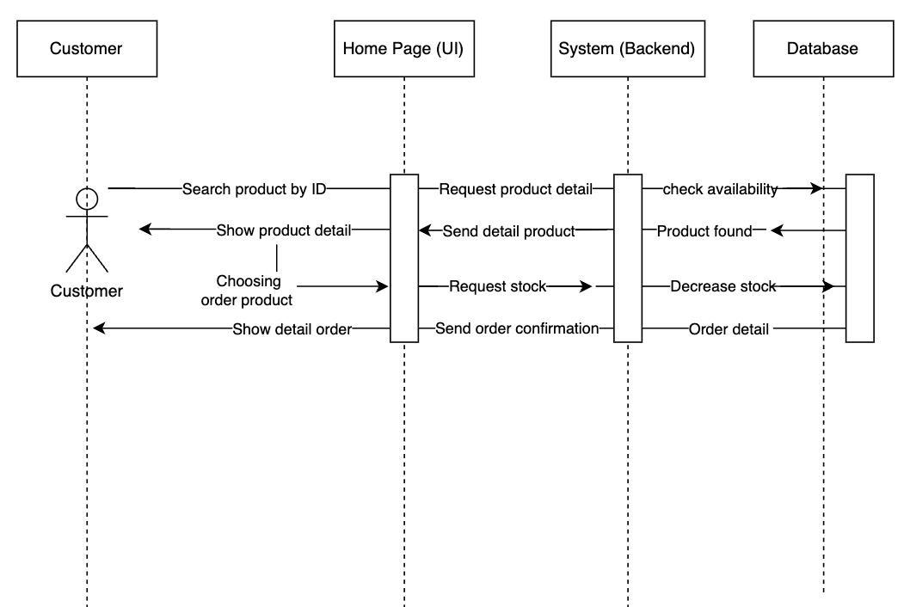
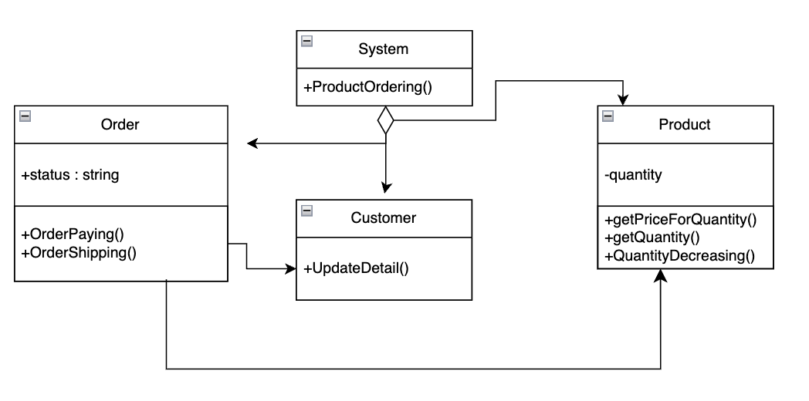

# E-Commerce Design Assigment
## High Level Design

Use sequence diagrams because sequence diagrams can represent high-level interactions between systems or sub-systems at a high level.

## Create Order Details



### Explanation

Pseudocode :

```
function ProductOrdering(){ 
  do request stock + generate order detail
  if productstock is available {
    UpdateDetail + GetQuantity
    }
  else {
    (Print("Out of Stock"))
 }

Function getPriceForQuantity(){
  let totalPrice = 0
  for product in ProductOrdering:
    totalPrice = OrderQuantity * Price
     productStock = 1
  return Customer
}

function Order (OrderPaying, OrderShipping) {
  if order success {
    do UpdateDetail (update status order to customer);
    do QuantityDecreasing;
    } 
 else order failed {
  Print ("Sorry Payment Failed")
  }
 return Customer 
}

Fuction QuantityDecreasing(){
  QuantityDecreasing = Quantity - GetQuantity
  return database
}
end
```

## Complexity Analysis

The complexity of creating a order is $O(n)$ with n=quantity. I got this complexity because Time Complexity of a loop is considered as  $O(n)$ if the loop variables are incremented/decremented by a constant amount.
